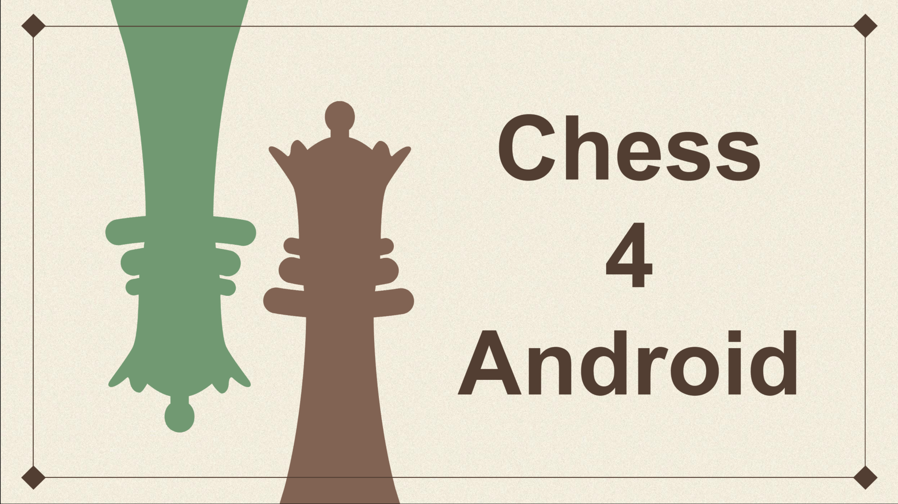

<h1 align="center"> Chess4Android </h1>

This project was developed during the Programming on Mobile Devices course.

  <a href="#technologies">Technologies</a>&nbsp;&nbsp;&nbsp; |&nbsp;&nbsp;&nbsp;
  <a href="#project">Project</a>&nbsp;&nbsp;&nbsp; |&nbsp;&nbsp;&nbsp;
  <a href="#presentation">Presentation</a>&nbsp;&nbsp;&nbsp; |&nbsp;&nbsp;&nbsp;
  <a href="#memo-license">License</a>

  

 

  

## Technologies

This project was developed with the following technologies:

- Kotlin
- Gradle
- Git
- GitHub

## Project

The project's main goal was to design an android application using the lichess API. The application aims to give the user the opportunity to play daily puzzles or play a normal chess game.

## Presentation

In the video below you can check the layout and how the application works:

### Useful links

- Access the lichess application [HERE](https://lichess.org/).

# :memo: License

This project is under the MIT License.

---

Developed by [Tiago Cebola](https://github.com/TiagoCebola) & [Gustavo Campos](https://github.com/gustavodev1998) & [Rúben Sousa](https://github.com/RubenSou), belonging to the LEIRT61D class at ISEL. :wave: